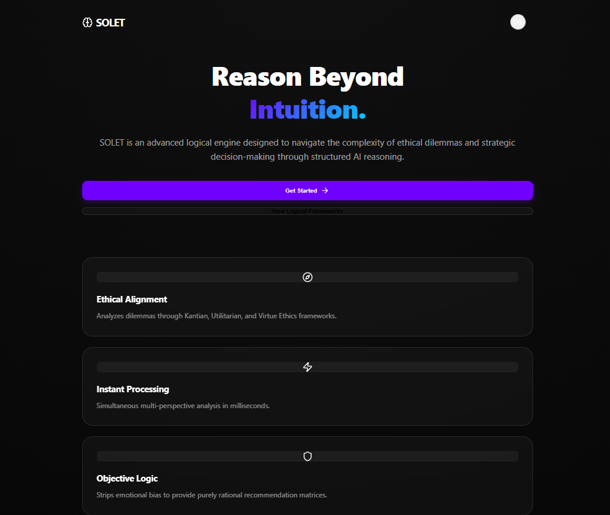
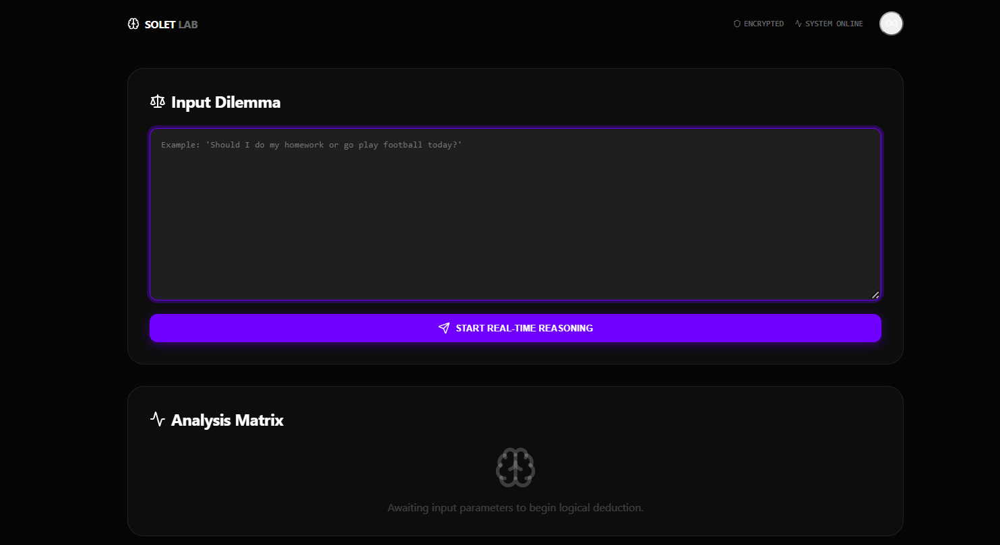

# Solet - AI Reasoning Decision Helper

A web application that helps you make better decisions by comparing two options and providing AI-powered reasoning on which choice is better and why.

**Live Demo:** [https://euphonious-pony-a76278.netlify.app/lab](https://euphonious-pony-a76278.netlify.app/lab)

## Screenshots

### Home Page


### Decision Analysis


## Features

- **AI-Powered Reasoning**: Uses Google's Gemini 2.5 Flash to analyze and compare two options
- **User Authentication**: Secure login via Supabase
- **Clean UI**: Modern, responsive interface built with React and Framer Motion
- **Real-time Analysis**: Get instant reasoning on why one option might be better
- **Decision History**: Track your previous comparisons with database storage

## Tech Stack

- **Framework**: Next.js 16 with React 19
- **AI Model**: Google Gemini 2.5 Flash via Generative AI API
- **Backend**: Next.js API Routes
- **Database & Auth**: Supabase
- **UI Components**: React with Framer Motion animations
- **Icons**: Lucide React
- **Language**: TypeScript

## Getting Started

### Prerequisites

- Node.js 18+ 
- npm or yarn
- Google Gemini API key
- Supabase account

### Installation

1. Clone the repository:
```bash
git clone https://github.com/axiom-afk/Solet.git
cd Solet
```

2. Install dependencies:
```bash
npm install
```

3. Create `.env.local` with your credentials:
```env
NEXT_PUBLIC_GEMINI_API_KEY=your_gemini_api_key
NEXT_PUBLIC_SUPABASE_URL=your_supabase_url
NEXT_PUBLIC_SUPABASE_ANON_KEY=your_supabase_anon_key
```

4. Run the development server:
```bash
npm run dev
```

Open [http://localhost:3000](http://localhost:3000) in your browser.

## Usage

1. **Navigate to the Lab**: Go to the `/lab` page
2. **Enter Two Options**: Input the two choices you want to compare
3. **Get AI Analysis**: Click submit and let Gemini provide reasoning
4. **View Results**: See which option is recommended and the detailed explanation

## Project Structure

```
src/
├── app/
│   ├── api/
│   │   └── reason/          # API endpoint for AI reasoning
│   ├── lab/                 # Main decision comparison page
│   ├── page.tsx             # Home page
│   └── globals.css          # Global styles
├── components/
│   └── LoginButton.tsx      # Authentication component
```

## Development

```bash
# Run development server
npm run dev

# Build for production
npm run build

# Start production server
npm start

# Run linter
npm run lint
```

## API Endpoint

**POST** `/api/reason`

Analyzes two options and returns AI reasoning.

**Request:**
```json
{
  "option1": "First choice",
  "option2": "Second choice"
}
```

**Response:**
```json
{
  "reasoning": "Detailed comparison and recommendation...",
  "recommended": "option1 or option2"
}
```

## Deployment

The app is deployed on Netlify. To deploy your own:

1. Push to GitHub
2. Connect your repository to Netlify
3. Add environment variables in Netlify dashboard
4. Deploy

## Environment Variables

- `NEXT_PUBLIC_GEMINI_API_KEY`: Google Gemini API key for AI reasoning
- `NEXT_PUBLIC_SUPABASE_URL`: Supabase project URL
- `NEXT_PUBLIC_SUPABASE_ANON_KEY`: Supabase anonymous key

## License

MIT

## Author

axiom-afk

## Contributing

Contributions are welcome! Feel free to submit issues and pull requests.

---

**Try it now:** [Solet Decision Helper](https://euphonious-pony-a76278.netlify.app/lab)
